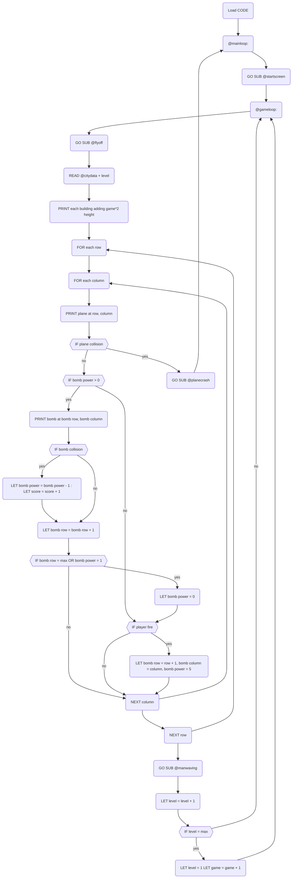

import { YouTube } from '@astro-community/astro-embed-youtube';

# Eigenblitz

This is an implementation of the VIC-20 game Blitz in Sinclair BASIC using a modern toolchain. Some bits are faithful and some bits are different depending on what I could use or figure out, or wanted to try in the time.
.tap file for use with a ZX Spectrum emulator (tested with Fuse).

[Download .tap file](https://github.com/eigengrouse/eigenblitz/releases/download/v1.0/eigenblitz.tap)

### A quick demo...
<YouTube id="https://youtu.be/utx6SkzX6hE" />

### A few notes on what I did...

[Talk is cheap, show me the code.](https://github.com/eigengrouse/eigenblitz)

I used a [custom font](https://www.jimblimey.com/blog/24-zx-spectrum-fonts/) (thanks [@jimblimey](https://x.com/jimblimey)), pasting the `defb` values into a Z80 .asm file and assembling with [pasmo](https://pasmo.speccy.org/) to create a .tap file. Deciding I only needed upper case text meant I had 26 lower case characters to provide graphics while still being able to use the nice and easy BASIC `PRINT` command.

Telling pasmo where in memory to assemble by adding this to the top of the file...

```asm
org 64000
```

...means you can load the font from BASIC with the following...

```bat
CLEAR 63999
LOAD "" CODE
REM load font at 64000
POKE 23607,249
```

The BASIC .zxb file was also converted to a .tap file using [zmakebas](https://github.com/z00m128/zmakebas), which gives you a few quality of life improvements such as labels instead of line numbers. One nice thing about .tap files is that you can just append your Z80 .tap file to your BASIC .tap file, which loads it using `LOAD "" CODE` and the resulting .tap file just works. The .bat build file is therefore pretty straight forward...

```bat
.\tools\pasmo.exe --tap main.asm code.tap
.\tools\zmakebas -l -a @begin -o basic.tap main.zxb
type basic.tap code.tap > eigenblitz.tap
del basic.tap
del code.tap
```

This build pipeline could also be used to include machine code routines if we know the `org` location. Or even a game fully implemented in Z80 with the BASIC loader loading the code then kicking it off. The BASIC loader is also where you could add a loading screen, which I didn't do this time but might come back to. The rest of the BASIC file is the game implementation.

#### Sinclair BASIC Implementation

Blitz is a simple game. The player's plane moves from left to right on a screen filled with buildings, moving a row down each time it reaches the far side. Bombs can be dropped that fall at the same speed the plane flies, that destroy up to 5 storeys, and only 1 bomb can be dropped at a time. If the player collides with a building they crash and the game restarts. If the player destroys all buildings then they can land and the next level is loaded.

The flowchart below shows the control flow and this is what was implemented in Sinclair BASIC ([code](https://github.com/eigengrouse/eigenblitz/blob/main/main.zxb)).

#### Game Loop Logic



### Final thoughts...

It probably took as long to create the flowchart and mess around with that as it did to write the Sinclair BASIC, and it was really just a bit of an exercise in learning [mermaidjs](https://mermaid.js.org/) which might be more useful in future. This whole game was a bit of a learning exercise in fact, but having an end product i.e the VIC-20 game gave me something to work towards and I was able to figure things out until I was happy enough that they did the job. It also meant I ended up with a game that was quite playable as this had already been thought out, where in the past I have just made things up as I've gone along and the end product was a bit all over the place. There's still plenty of room for creativity and even creating the build pipeline was really satisfying and fun even. So I quite like this way of working and will try to have a clear idea of what I'm trying to achieve for future projects.